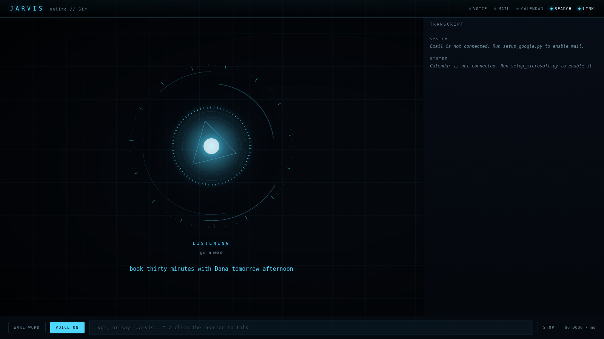
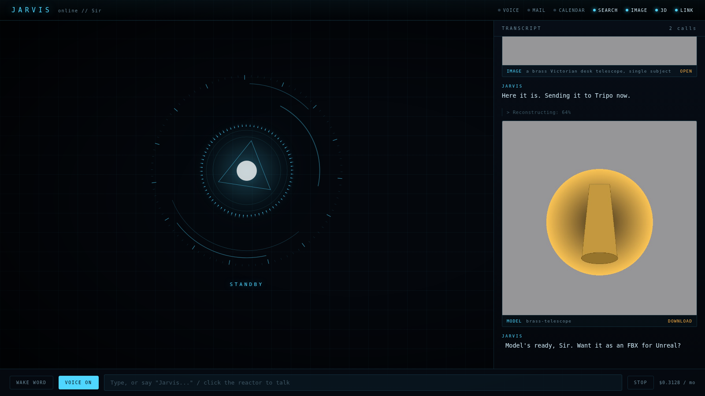
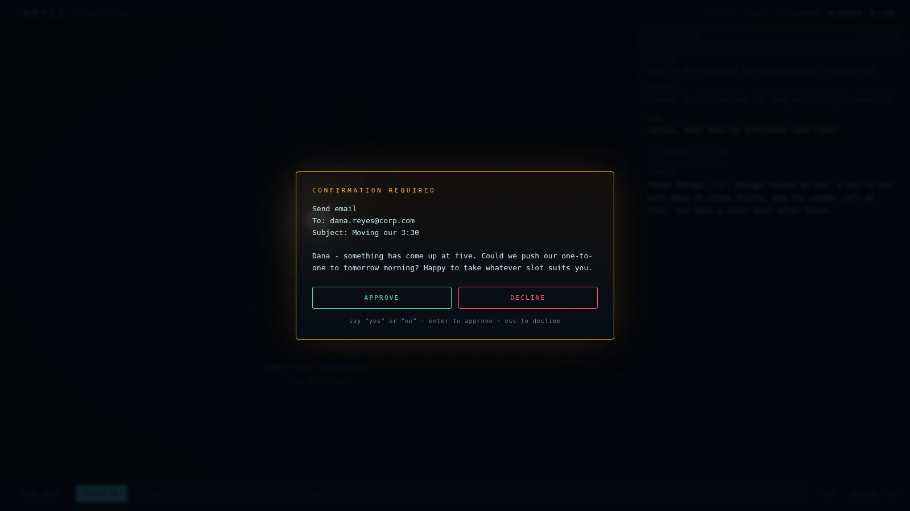

# JARVIS

A voice-driven personal assistant that runs on your own machine. Talk to it,
watch it think on a heads-up display, and let it work your email, your
Teams/Outlook calendar, and the open web on your behalf.

Built to be cheap. The expensive parts of an assistant like this are normally
speech recognition, speech synthesis, and a large model on every turn. This
avoids all three: speech in and out uses the browser's built-in Web Speech API
(free, unlimited, no cloud STT bill), and a router sends routine turns to a
small model, escalating to a larger one only when a turn actually needs
reasoning.



---

## What it can actually do

| Capability | Status | Notes |
|---|---|---|
| Conversational voice in/out | Working | Chrome or Edge. Wake word "Jarvis", or click the reactor. |
| Answers to his name | Working | Say "Jarvis" alone and he replies; say it while he is talking and he stops. |
| Web search + read pages | Working | Brave API free tier, DuckDuckGo fallback. |
| Read / search Gmail | Working | Personal mailbox. Full Gmail query syntax. |
| Read / search Outlook | Working | Work mailbox, via Graph *or* the desktop app. |
| Draft and send email | Working | Both mailboxes. Sending is confirmation-gated. |
| Read Teams/Outlook calendar | Working | Via Microsoft Graph. |
| Find free time | Working | Skips weekends and existing commitments. |
| Book meetings, incl. Teams links | Working | Confirmation-gated. |
| Cancel meetings | Working | Confirmation-gated; attendees notified. |
| Generate images | Working | FLUX schnell, shown in the HUD. |
| Text straight to 3D | Working | Tripo3D, one step, no image needed. |
| Image to 3D | Working | Tripo3D reconstruction from a generated or supplied image. |
| Convert 3D formats | Working | GLB, FBX, OBJ, STL, USDZ, GLTF, 3MF. |
| Long-term memory | Working | Survives restarts. |
| Send texts | **Partial** | See [Texting](#texting) — this is the honest weak spot. |

---

## What this costs

**Everything except the model is free.**

| Piece | Cost |
|---|---|
| Speech recognition | $0 — browser Web Speech API |
| Speech synthesis | $0 — browser, Edge has good neural voices |
| Web search | $0 — Brave free tier, 2,000 queries/month |
| Gmail + Google Calendar API | $0 |
| Microsoft Graph API | $0 with a work account |
| Hosting | $0 — runs on your PC |
| **Claude API** | **recurring** — see below |
| **Image generation** | **~$0.003/image** on fal; free on Together's schnell endpoint |
| **Tripo3D** | **your existing Tripo credits** — the priciest thing here per action |

At list prices, Haiku 4.5 is $1/$5 per million input/output tokens and Sonnet 5
is $2/$10. A typical turn with a cached prompt costs a fraction of a cent.

Three things keep the bill down, and they are worth understanding because they
are the whole design:

1. **Model routing** (`core/models.py`). Pure string heuristics — no LLM call,
   so routing is free. "What's on my calendar" goes to Haiku. "Help me think
   through this offer" goes to Sonnet. Long tool chains escalate automatically.
2. **Prompt caching.** The system prompt and tool definitions are cached. That
   prefix is deliberately byte-stable: nothing volatile is interpolated into it
   (this is why the current time is a *tool* rather than a line in the prompt —
   a timestamp there would invalidate the cache on every single request).
   Cache reads bill at 10% of input.
3. **A hard budget.** `JARVIS_MONTHLY_BUDGET_USD` stops new turns once you hit
   it, instead of quietly running up a bill. Live spend is in the bottom-right
   of the HUD and in `/api/status`.

Realistically, personal use lands around **$3–8/month** for the assistant
itself. Heavy daily research use gets you to $15.

**3D is the exception, and it is worth being clear about.** Every model burns a
Tripo credit, and credits cost real money — far more per action than a
conversation turn. Two things follow, and both are built in: Jarvis is told not
to speculatively generate variations you did not ask for, and `check_3d_credits`
lets you ask what is left at any time. If you generate models all day, Tripo
will be the largest line on your bill by a wide margin, and no amount of
cleverness on my side changes that.

Going text-to-3D directly instead of image-then-3D saves you the image cost and
one step, so Jarvis prefers it unless you want to see the look first.

To spend even less, set `JARVIS_DEEP_MODEL=claude-haiku-4-5` so everything runs
on the cheap model. Quality on multi-step research drops noticeably; routine
turns are indistinguishable.

---

## Setup

Requires **Python 3.11+**, **Chrome or Edge**, and a microphone.

### 1. Install

Requires Python 3.11 or newer. Check with `python --version`; if Windows opens
the Microsoft Store instead, install Python from
<https://python.org/downloads> and tick **Add python.exe to PATH**.

**The easy way — double-click `start.bat`.** It creates the virtual
environment, installs everything, creates your `.env` on first run, and starts
Jarvis. It calls the environment's Python directly rather than using
`activate`, so it does not care which terminal you are in and PowerShell's
execution policy cannot block it. Use it for every launch, not just the first.

Everything below is the manual equivalent, if you would rather see the steps.

In **Command Prompt** (not PowerShell — see the note below):

```bat
cd jarvis
python -m venv .venv
.venv\Scripts\activate
pip install -r requirements.txt
copy .env.example .env
```

> **PowerShell users:** `.venv\Scripts\Activate.ps1` is often blocked by the
> default execution policy, with "running scripts is disabled on this system".
> Either use Command Prompt, or allow it for that one window:
> `Set-ExecutionPolicy -Scope Process -ExecutionPolicy Bypass`

You will know activation worked because the prompt gains a `(.venv)` prefix.
Every later command assumes it is active — if you open a new terminal, run
`.venv\Scripts\activate` again first.

### 2. Add your Claude API key

Get one at <https://console.anthropic.com>. Put it in `.env`:

```
ANTHROPIC_API_KEY=sk-ant-...
JARVIS_USER_NAME=Duke
JARVIS_TIMEZONE=America/New_York
```

`JARVIS_USER_NAME` is what he calls you, out loud and in the transcript. He is
told to use it about one turn in three — every turn grates, never is cold.

**At this point it already works** — voice, conversation, memory, and web
search (on the DuckDuckGo fallback). Run `python run.py` and try it. Everything
below adds capabilities.

### 3. Web search (optional, 2 minutes)

Sign up at <https://brave.com/search/api/> and pick the **Free** plan — 2,000
queries a month, no card. Put the key in `.env` as `BRAVE_API_KEY`. Results are
much better than the fallback.

### 4. Images and 3D (optional, 5 minutes)

**Images.** Pick one and put the key in `.env`:

- **fal.ai** (default) — sign up at <https://fal.ai>, create an API key, set
  `FAL_KEY`. FLUX schnell, about $0.003 an image.
- **Together AI** — key from <https://api.together.xyz>, set
  `TOGETHER_API_KEY` and `JARVIS_IMAGE_PROVIDER=together`. They have run a free
  FLUX schnell endpoint; if `FLUX.1-schnell-Free` stops working, change
  `TOGETHER_IMAGE_MODEL` to `black-forest-labs/FLUX.1-schnell`.

**3D.** Get an API key from <https://platform.tripo3d.ai> (the API section of
your account) and set `TRIPO_API_KEY`. It draws on the Tripo credits you
already have, and everything Jarvis generates lands in your normal Tripo
workspace, so you can open it in the Tripo web app afterwards.

If your Tripo account is on the China endpoint, set
`TRIPO_BASE_URL=https://openapi.tripo3d.com/v3`.

### 5. Gmail (optional, 10 minutes)

1. Go to <https://console.cloud.google.com> and create a project.
2. **APIs & Services → Library**: enable **Gmail API** and **Google Calendar API**.
3. **APIs & Services → OAuth consent screen**: choose **External**, fill in the
   required fields, and add your own Google account under **Test users**.
   (You do not need to publish the app or get it verified — as a test user, you
   can use it indefinitely.)
4. **Credentials → Create credentials → OAuth client ID → Desktop app**.
   Download the JSON and save it as `jarvis/credentials_google.json`.
5. Run it once:

```bat
python setup_google.py
```

A browser opens; approve access. Google will warn that the app is unverified —
that is expected for a personal app you built yourself. Click through
**Advanced → Go to (your app)**.

### 6. Outlook email and calendar (optional)

There are two routes. They expose exactly the same tools, so pick whichever
your employer permits — nothing else in Jarvis changes.

| | **Local** | **Graph** |
|---|---|---|
| Needs IT approval | No | Yes — an Azure app registration |
| Requires | Classic Outlook desktop, installed and running | Nothing running locally |
| Teams links on invites | No | Yes |
| Works when Outlook is closed | No | Yes |

**Most locked-down tenants block app registrations**, which makes Local the
only option. Jarvis picks automatically: Graph if it is configured, otherwise
the desktop app. Force it with `JARVIS_OUTLOOK_MODE` set to `local`, `graph`
or `off`.

#### Route A — the local Outlook app (no approval needed)

Nothing new talks to Microsoft. Outlook is already signed in and already
authorised; Jarvis asks *it* for things over COM, as you, on your machine.
There is no consent screen because there is nothing to consent to.

```bat
.venv\Scripts\activate
pip install -r requirements.txt
```

That installs `pywin32` (Windows only). Restart, and the banner should read
`Work mail : Outlook desktop app`.

Two constraints worth knowing:

- **Classic Outlook only.** The "new Outlook" for Windows dropped COM, VBA and
  MAPI entirely. If there is a **New Outlook** toggle in the top right, switch
  it off. If it is greyed out, your org has forced new Outlook and this route
  is closed.
- **A Teams link cannot be attached automatically.** Invites work; the Teams
  link has to be added from the invite window yourself. Jarvis will say so
  rather than pretending otherwise.

Outlook has to be running. If it is not, Jarvis says so instead of failing
obscurely.

#### Route B — Microsoft Graph (needs an app registration)

One registration covers both mail and calendar.

1. Go to <https://portal.azure.com> → **Microsoft Entra ID** → **App registrations** → **New registration**.
2. Name it "Jarvis". Under **Supported account types** pick the option that
   includes your work account. Skip the redirect URI.
3. On the app's **Authentication** page, set **Allow public client flows** to
   **Yes**. This is what makes the device-code login work.
4. Copy the **Application (client) ID** into `.env` as `MS_CLIENT_ID`. If your
   employer restricts things to one tenant, also set `MS_TENANT_ID` to the
   **Directory (tenant) ID**.
5. Run it once:

```bat
python setup_microsoft.py
```

It prints a code and a URL. Open the URL, enter the code, sign in.

Jarvis requests five delegated scopes: `User.Read`, `Calendars.ReadWrite`,
`OnlineMeetings.ReadWrite`, `Mail.ReadWrite` and `Mail.Send`. Delegated means
it can only ever see and do what **you** can — it is your account acting, not a
service account with standing access to the tenant.

> **If your employer blocks app registrations** — many do — ask IT to register
> it, or to consent to those five scopes. There is no way around this step; it
> is your company's mailbox and calendar.

> **If you change the scopes later**, re-run `setup_microsoft.py`. MSAL caches
> tokens against the exact scope set it was granted, so a new permission does
> not take effect until you sign in again.

### 7. Run

```bat
start.bat
```

or, with the environment active:

```bat
python run.py
```

Jarvis checks its own configuration first and refuses to start with a plain
list of what is missing, rather than failing later mid-conversation.

Your browser opens on the HUD. **Open it in Microsoft Edge** — the URL is
`http://127.0.0.1:8765`. Edge exposes Microsoft's neural voices to the Web
Speech API; Chrome falls back to markedly worse ones, and Firefox and Safari
have no speech recognition at all.

Click **WAKE WORD**, allow the microphone when prompted, and say "Jarvis". The
toggle is remembered, so later launches come back listening.

To stop it, press `Ctrl+C` in the terminal.

---

## Using it

- **Say "Jarvis, ..."** — then your request, in one breath.
- **Say just "Jarvis"** — he answers ("Yes, Duke?") and waits. Useful when you
  know you want him but have not finished thinking. The acknowledgement is
  spoken locally, so it is instant and costs nothing.
- **Say "Jarvis" while he is talking** — he stops mid-sentence and listens.
- **Click the reactor** or **press Space** to talk without the wake word.
- **Type** in the box at the bottom if you would rather not speak.
- **STOP** interrupts both the reply and the speech.
- **SPEAK ON/OFF** mutes spoken replies but keeps the transcript.
- **VOICE…** opens the voice picker.

### Choosing a voice

**VOICE…** in the footer lists every English voice your browser offers. Click
one to hear it, drag rate and pitch to taste, and the choice is remembered.
**RESET** goes back to automatic selection and the default tuning.

Voices marked NEURAL are the good ones. In Edge these are Microsoft's
"Online (Natural)" voices; **Ryan** and **Thomas** are the British male ones
worth trying first. Left alone, Jarvis picks the best British male voice
available, falling back through Chrome's `Google UK English Male` and then
whatever English voice exists.

Rate and pitch default to 1.06 and 0.92 — slightly quick and slightly low,
which reads as efficient and authoritative rather than plodding. They are the
fastest way to change how he comes across without changing voice.

WAKE WORD is remembered between sessions. Turn it on once and Jarvis comes back
listening on the next launch, as long as the browser still holds the mic
permission.

### Answering to his name

Speech recognition mangles "Jarvis" fairly predictably — it is an uncommon
word, so the recogniser reaches for real ones it knows. `web/wake.js` matches
the substitutions that actually turn up: *jervis, jarvus, javis, jarvice,
charvis, harvis, travis*, and a few more.

That list errs towards matching on purpose. A false positive opens a capture
window that times out after six seconds and costs nothing; a false negative
means Jarvis ignored you, which is the failure you actually notice. If you know
a Travis and the trade annoys you, drop it from `VARIANTS` in `web/wake.js` —
the list is deliberately plain to edit, and `node tests/test_wake.js` checks it.

Barge-in leaves the microphone open while Jarvis speaks, relying on the
browser's echo cancellation so he does not hear himself. If he ever interrupts
himself on your hardware, set `BARGE_IN = false` near the top of the Voice
module in `web/hud.js`.

Things worth trying:

```
Jarvis, what does my afternoon look like?
Jarvis, find me thirty minutes with Dana this week and book it.
Jarvis, any unread work email?
Jarvis, what did Dana send about the Q3 numbers?
Jarvis, reply to that and say Thursday works.
Jarvis, research whether I should replace the water heater or repair it.
Jarvis, remember that I do deep work before eleven and hate meetings then.
Jarvis, draft a reply to that last email saying I need another day.
Jarvis, model me a brass Victorian desk telescope.
Jarvis, generate an image of a weathered bronze owl statue, then make it 3D.
Jarvis, give me that last model as an FBX for Unreal.
Jarvis, is my model done yet?
Jarvis, how many Tripo credits do I have left?
```

### Images and 3D

Ask for an object and Jarvis goes **straight to 3D** — one Tripo call, no image
in between. Ask to *see* it first and it generates an image, shows it to you,
and converts that once you are happy.

Images destined for 3D are composed differently on purpose: single centred
subject, plain grey background, flat even lighting, nothing cropped. That is
what reconstruction needs, and it is why `generate_image` has a `for_3d` flag
rather than leaving you to remember it.



Both appear in the transcript as you go — the image inline, the finished model
as Tripo's rendered preview with a download link. Click either to view it full
size. Generations take tens of seconds to a couple of minutes, and the HUD
shows live progress rather than going silent. If a job outruns the turn, Jarvis
hands you the job id and you can ask "is it done yet?" later.

Models download as GLB by default. Ask for FBX, OBJ, STL, USDZ, GLTF or 3MF and
Jarvis converts it. Download links from Tripo expire after about two hours, but
the model stays in your Tripo workspace.

### Confirmations

Anything that leaves your machine — sending email, booking or cancelling a
meeting, sending a text — stops and shows you exactly what is about to happen.



Say "yes" or "no", press Enter or Escape, or click. This gate is enforced in
`core/agent.py`, not by the model, so no amount of clever prompting gets around
it. If you add tools of your own, set `confirm = True` on anything with
outside-world consequences.

---

### Two mailboxes

Gmail and Outlook can both be connected, and they stay separate: Gmail is the
personal mailbox (`search_email`, `send_email`), Outlook is the work one
(`search_work_email`, `send_work_email`). The tool descriptions say which is
which, so "any unread work email?" and "check my personal mail" go to the right
place. Connect either, both, or neither.

## Texting

This is the honest gap, and it is a Windows problem rather than a Jarvis one.

Windows has no usable API for sending SMS from your own phone number. Phone
Link has no public API, and Apple's iMessage database trick only exists on
macOS. So `tools/messaging.py` ships a pluggable interface with three backends,
chosen by `JARVIS_SMS_PROVIDER` in `.env`:

| Provider | Cost | What it does |
|---|---|---|
| `none` (default) | — | Jarvis explains that texting is not set up. |
| `ntfy` | Free | Pushes a notification to **your own** phone. Not SMS; cannot message other people. Covers "remind me" and "ping me when". Set `NTFY_TOPIC` to a long random string and install the ntfy app. |
| `twilio` | ~$1.15/mo + $0.0079/text | Real SMS to anyone. The only option that genuinely texts a third party. Set `TWILIO_ACCOUNT_SID`, `TWILIO_AUTH_TOKEN`, `TWILIO_FROM_NUMBER`. |

To add your own backend, subclass `Provider` and register it in `_PROVIDERS`.

---

## How it fits together

```
Browser (HUD)                        Python backend
─────────────                        ──────────────
web/wake.js    wake-word matching    core/server.py   FastAPI + WebSocket
web/hud.js                           core/agent.py    streaming tool loop
  Web Speech API  ◄── speech ──►     core/models.py   fast/deep routing
  canvas reactor                     core/memory.py   SQLite
  transcript      ◄── WebSocket ──►  core/prompt.py   cached system prompt
  confirm modal   ◄── approve ──►    tools/           20 tools
```

One WebSocket per browser tab. The agent streams text deltas as they arrive, so
speech starts before the model has finished thinking. Tool calls in a single
response run concurrently, except confirmation-gated ones, which are serialised
so you are never asked two questions at once.

### Adding a tool

Subclass `Tool`, then register it in `tools/__init__.py`:

```python
class WeatherTool(Tool):
    name = "get_weather"
    description = "Current conditions for a city. Use when the user asks about weather."
    schema = {
        "type": "object",
        "properties": {"city": {"type": "string"}},
        "required": ["city"],
    }

    async def run(self, city: str) -> str:
        return f"It is 18 degrees and raining in {city}."
```

Two rules. Write the `description` for the model, not for a human — say when to
call it, not just what it does; that text is most of what determines whether the
tool gets used correctly. And set `confirm = True` on anything irreversible.

Tools are registered defensively: if an integration's dependencies are missing
or broken, that capability logs a warning and disables itself rather than
taking the whole assistant down.

---

## Security

- Everything runs locally. The only outbound traffic is to Anthropic, Google,
  Microsoft, and whatever you search.
- The server binds `127.0.0.1` by default. **Do not** change `JARVIS_HOST` to
  `0.0.0.0` — there is no authentication, and anyone on your network would get
  your mailbox.
- `token_google.json` and `token_microsoft.json` grant access to your mail and
  calendar. They are gitignored. Treat them like passwords.
- Web search results and page content are model input. Be aware that a hostile
  page can attempt prompt injection; the confirmation gate on outbound actions
  is your backstop, which is precisely why it exists.

---

## If something goes wrong

| Symptom | Cause |
|---|---|
| `ModuleNotFoundError: No module named 'win32com'` | `pywin32` is not installed. `start.bat` reinstalls automatically when `requirements.txt` changes, so a `git pull` then `start.bat` fixes it; or run `pip install -r requirements.txt` by hand. |
| `ModuleNotFoundError: No module named 'uvicorn'` | The virtual environment is not active in this terminal, so Python cannot see what you installed into it. Run `.venv\Scripts\activate` first, or just use `start.bat`. |
| `'python' is not recognized` | Python is not on PATH. Reinstall from python.org with "Add python.exe to PATH" ticked. |
| "running scripts is disabled on this system" | PowerShell execution policy. See the note in step 1. |
| `No time zone found with key ...` | The `tzdata` package is missing, or `JARVIS_TIMEZONE` is not a valid IANA name. `pip install tzdata`. |
| Nothing happens when you speak | You are not in Edge or Chrome, or the mic permission was denied. Check the VOICE lamp in the header. |
| Voice sounds robotic | You are in Chrome. Use Edge, then pick a NEURAL voice under VOICE&hellip;. |
| Wrong accent | Open VOICE&hellip; and pick Ryan or Thomas. |
| He ignores you | Wake word missed. Click the reactor instead, and see "Answering to his name". |
| `[Errno 10048] address already in use` | Port 8765 is taken, probably by an older Jarvis. Close it, or set `JARVIS_PORT` in `.env`. |
| Google says the app is unverified | Expected for a personal app. Advanced → Go to (your app). |
| Azure blocks the app registration | Very common. Use the local Outlook route in step 6 instead — it needs no approval. |
| `tool_use ids were found without tool_result blocks` | A turn was interrupted mid-confirmation on an older build. Fixed — pull and restart. Reloading the page always starts a fresh conversation. |
| `Could not reach Outlook` | Classic Outlook is not running, or you are on "new Outlook", which has no automation support. |

## Known limitations

- **Chrome or Edge only.** Web Speech API is not in Firefox or Safari.
- **The wake word is client-side and approximate.** It matches "Jarvis" and the
  common mishearings listed in `web/wake.js`. It will occasionally miss; click
  the reactor instead.
- **Chrome ends recognition sessions every ~60 seconds.** The HUD restarts them
  automatically, but you may see a brief gap.
- **Interrupting by voice needs working echo cancellation.** The mic stays open
  while Jarvis speaks so his name can cut him off. On a headset this is
  reliable; on open laptop speakers at high volume he may occasionally hear
  himself. STOP and Space always work.
- **`find_free_time` only knows your calendar**, not your attendees'. Checking
  their availability needs `Calendars.Read.Shared` and a code change.
- **No background operation.** Jarvis acts when spoken to; it does not watch
  your inbox. A scheduler is the obvious next addition.
- **3D generation is not instant.** Expect 30 seconds to a few minutes. A turn
  waits `TRIPO_WAIT_SECONDS` (default 240) and then hands back a job id.
- **Image-to-3D is only as good as the image.** One clean, centred, unshadowed
  object works; a busy scene, a cropped subject, or heavy shadows produce bad
  geometry. `for_3d=true` exists to prevent exactly that, so let Jarvis use it.
- **Tripo download URLs expire in about two hours.** Jarvis does not mirror the
  mesh locally — only generated *images* are saved to `data/images`. Grab the
  file, or re-download it from your Tripo workspace.

---

## Tests

```bat
python tests\run_all.py
```

No API key and no network needed. They cover the routing heuristics, cost
maths, conversation-history repair, SQLite persistence, concurrent tool
execution, the confirmation gate (approve *and* decline paths), error handling,
and the WebSocket protocol end to end with a stubbed agent. The Tripo3D client
runs against a local mock speaking the documented v3 envelope. Wake-word
matching is checked by `tests/test_wake.js` under Node, against the same file
the browser loads — that suite is skipped if Node is not installed, since
Jarvis itself does not need it.
